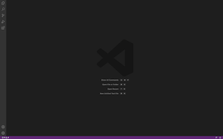
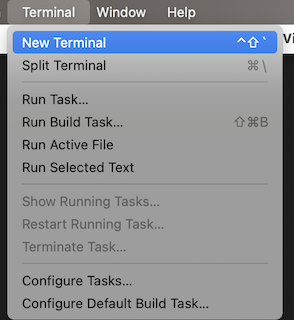
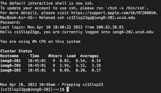
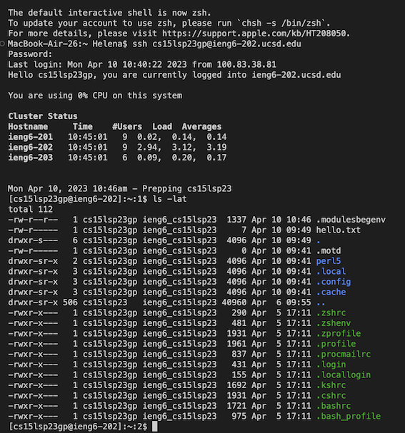
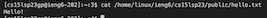

# Lab Report 1: Remote Access and FileSystem

  ## This is a tutorial for incoming 15L students on how to log into a course-specific account on `ieng6`.

*Note: At the time of writing this tutorial I am still facing account issues with ssh-ing into the course-specific Linux account and was instructed
  to ssh into ieng6-202 directly in the meantime. Students who are not facing this issue should simply ssh without the "-202".* 
  
---

**Step 1: Getting started with Visual Studio Code**

*This step may be skipped if you have VS Code downloaded*

Download Visual Studio Code from their website by clicking the link and following their instructions: [VS Code](https://code.visualstudio.com/)

Once installed the homescreen should look like this (colors and menu bar may very due to differences in settings): 

---

**Step 2: Remotely Connecting**

*I use macOS and therefore do not need to take the extra step of installing git. For those using Windows, you will have to install git and set the default terminal to be `git bash` in VS Code. These links will help with that process: [Git for Windows download](https://gitforwindows.org/), [How to use Bash on Windows in VS Code](https://stackoverflow.com/a/50527994)*

1. Open a terminal in VS Code:

  To open a new terminal, either use Ctrl/Command +, or select Terminal -> New Terminal from the menu bar (this is what I prefer to use)
  
  
  
2. Using ssh:

  Type in the command: `ssh cs15lsp23xx@ieng6.ucsd.edu`
  
  *Replace the xx with the letters from your course-specific account (example: in my case 'gp', so the command would read `ssh cs15lsp23gp@ieng6-202.ucsd.edu`for me)*
  
  If it is your first time connecting to this server you will get a message that looks similar to this: 
  
  *(I used "-240" so as to get an example image of a first time log in, as I have logged into 202 before)*
  
  You should see output similar to this:
  
 > MacBook-Air-26:~ Helena$ ssh cs15lsp23gp@ieng6-240.ucsd.edu
 > The authenticity of host 'ieng6-240.ucsd.edu (128.54.70.240)' can't be established.
 > RSA key fingerprint is SHA256:ksruYwhnYH+sySHnHAtLUHngrPEyZTD/1x99wUQcec.
 > Are you sure you want to continue connecting (yes/no/[fingerprint])?
  
 
  Answer yes to the prompt by typing it into the command line and press enter.
  
  Then type in your password and press enter.
  
  (Be aware: your password will be hidden from view when you are writing it)
  
  You should then see something like this:
  
  
  
  **You are now remotely connected!**
 
 
---
 
**Step 3: Trying Some Commands** 

Test out different combinations of the commands: `cd`, `cp`, `pwd`, `ls` and `mkdir` on the remote computer (where you should be after ssh-ing)

Some combinations to try are:
  * `cd` -> sets the working directory to the home directory 
        
  (I learned what that looks like, and that this is only the case if cd has no following paths, otherwise cd <path> changes the current working directory to that of the given path)
  * `cd ~`-> will always take you to the home directory 
  
  (I learned what it looks like to be taken to the home directory)
  * `ls -lat` -> will print out the files/folders in lat 
  
  (I learned that ls '<path>' prints out the files and folders in the provided path)
  * `cat /home/linux/ieng6/cs15lsp23/public/hello.txt` -> will print out what is stored in hello.txt
  
  (Learned how to print out contents from files provided by the path cat '<path>')
  * `ls /home/linux/ieng6/cs15lsp23/cs15lsp23abc` -> should print out files stored under the provided username

    *The part after `ls` is the course-specific directory. Replace 'abc' with the username of someone else in the course.*
 (Learned how to access anothers users files/computer)
  
You should expect to see similar output from using the command `ls -lat` as below:

You should expect to see similar output from using the command `cat /home/linux/ieng6/cs15lsp23/public/hello.txt` as below:

---
   
**To log out of the remote server in your terminal:**
  Use Ctrl-D and then run the command `exit`
