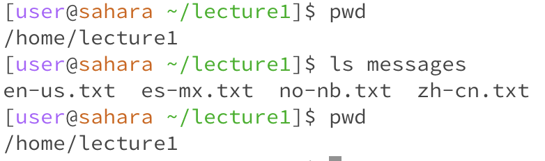

# Lab Report 1
## Helena Onsum, CSE 15 L
-----------------------------------------------
*Using `cd` , `ls` , and `cat`.*

**An example of using the command with no arguments:**
* `cd` :

* `ls` :
  

* `cat` :
  

cntrl c to x out, cat waiting for arg -long running prgrm, no change to 
working dir, outout not error per say -doing what its supposed to, but it does not perform
its function

**An example of using the command with a path to a directory as an argument:**
* `cd` :
  

* `ls` :
  

* `cat` :
  

**An example of using the command with a path to a file as an argument:**
* `cd` :
  

* `ls` :
  

* `cat` :
  

