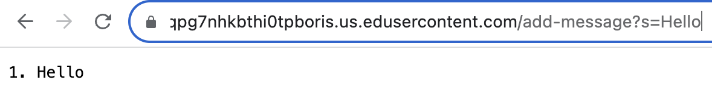
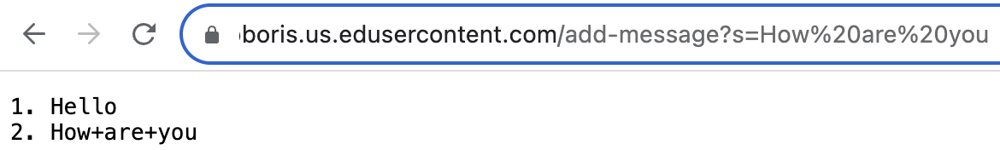
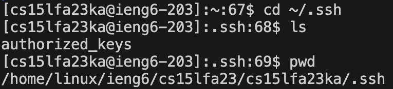
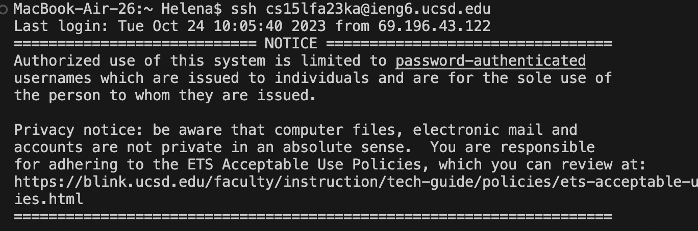

# Lab Report 2
## Helena Onsum, CSE 15 L
-----------------------------------------------
# *Servers and SSH Keys.* 

**PART 1:**
**This is my code for StringServer:**

**Screenshot after request:** `add-message?s=Hello` :

  - For this code,first my main method in my StringServer class was called. This was before running the above request, but the method was called to start the server as it checked the presence of a pot number and then started a server. After making the above request for "Hello" to be added to my string, my handleRequest method was called to process the request and add "Hello" to my string.
  - A string array is the relevant argument to the main method in my StringServer class, where the last element should be a port number for the server to start. The relevant argument to my handleRequest method is a url( `URI url`). This contains the url details as well as the requests made to add strings. In this method, the relevant fields are `count` and `str`, which count the string addition requests and stores the strings added in a single string, respectively. The values of `count` is `int`s starting from 0 and increasing by each request to add a string. The values of `str` is a string which gets larger by each string addition.
  - The values of both `count` and `str` got changed with the request `add-message?s=Hello`. `count` increased from the default 0 to be 1 as one request to add a string had now been made. `str` went from being an empty string, to now containing "1. Hello".

**Screenshot after request:** `add-message?s=How are you` :

  - After making the above request for "How are you" to be added to my string, my handleRequest method was called to process the request and add "How are you" to my string.
  - The relevant argument to my handleRequest method is a url( `URI url`). This contains the url details as well as the requests made to add strings. In this method, the relevant fields are `count` and `str`, which count the string addition requests and stores the strings added in a single string, respectively. The values of `count` is `int`s starting from 0 and increasing by each request to add a string. The values of `str` is a string which gets larger by each string addition.In this method, the relevant fields are `count` and `str`, which count the string addition requests and stores the strings added in a single string, respectively. The values of `count` is `int`s starting from 0 and increasing by each request to add a string. The values of `str` is a string which gets larger by each string addition.
  - The values of both `count` and `str` got changed with the request `add-message?s=How are you`. `count` increased from 1 to be 2 as two requests to add a string had now been made. `str` went from being "1. Hello", to now containing "1. Hello 2. How are you".

**PART 2:**
**The path to the private key for my SSH key for `ieng6` log-in from local computer:**

*The private key is stored in the id_rsa file, which is found in the directory /Users/Helena/.ssh on my computer.*

**The path to the public key for my SSH key for `ieng6` log-in withing my `ieng6` account:**

*The public key is stored in the authorized_keys file, which is found in the directory /home/linux/ieng6/cs15lfa23/cs15lfa23ka/.ssh on `ieng6`*

**Below is a screenshot of a terminal interaction where I logged into `ieng6` with my account without using a password:**

**PART 3:**
*So far there is very little I knew before lab, so the following are just a few examples.* 
- In lab week 2 I learned about remote computers and how you can access them with the SSH command through the terminal. I realize how helpful and practical this is in proffesional/work environments. In the same lab I got a deeper understanding of what a server is and how much information a URL contains. In week 3 I learned about running a server on my local computer with VSCode and visiting the url `http://localhost:[enter port number]`. This was new to me as I had only known how to do this in EdStem before. 
