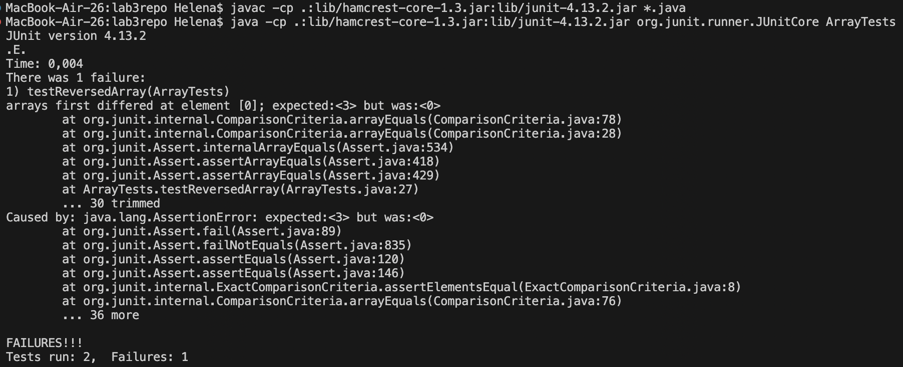

# Lab Report 3
## Helena Onsum, CSE 15 L
-----------------------------------------------
# *Bugs and Commands* 

**PART 1 - BUGS:**
*I choose the bug in the reversed method of ArrayExamples.java*

**Below is a failure-inducing input for the buggy program, as a JUnit test:**
```
 import static org.junit.Assert.*;
 
 import org.junit.*;
 
 public class ArrayTests {
 
 @Test
 
    public void testReversedArray() {
    
      int[] input = {1, 2, 3};
      
      assertArrayEquals(new int[]{3, 2, 1}, ArrayExamples.reversed(input));
      
    }
    
  }
```

**Below is an input that doesn't induce a failure, as a JUnit test:**
```
  import static org.junit.Assert.*;
  
  import org.junit.*;
  
  public class ArrayTests {
  
  @Test
  
    public void testReversedNoFailure() {
    
      int[] input = { };
      
      assertArrayEquals(new int[]{ }, ArrayExamples.reversed(input));
      
    }
    
  }
```
  
**Below is the symptom, and the output of running the above tests:**


* The most interesting part of the output is the line *[0]; expected:<3> but was:<0>*. This means that the first index of the new array was 0, not 3 as it should have been if the elements in the old array had been properly reversed. It is notable that none of the elements in the original array had the value **0** either.

**Below is the buggy reversed method**

```
static int[] reversed(int[] arr) {

    int[] newArray = new int[arr.length];
    
    for(int i = 0; i < arr.length; i += 1) {
    
      arr[i] = newArray[arr.length - i - 1];
      
    }
    
    return arr;
    
  }
```
  
**Below is the reversed method after the bug was fixed**
```
   static int[] reversed(int[] arr) {
   
   int[] newArray = new int[arr.length];
   
   for(int i = 0; i < arr.length; i += 1) {
   
      newArray[i] = arr[arr.length - i - 1];
      
    }
    
    return newArray;
    
  }
```

* The bug was that in the old code, the method reversely accessed the elements of the newArray and replaced the ones in the old array with them (all newArray elements would all have the value 0 as default values). By changing the lines
```
    arr[i] = newArray[arr.length - i - 1];
  
    }
  
    return arr;
  
    }
```
  
   to be
```
   newArray[i] = arr[arr.length - i - 1];
   
   }
   
   return newArray;
   
   }
```
   
the code now accesses the elements of the old array reversely and adds them to the newArray. This means that the newArray will not correctly contain the elements of the old array, but in reverse order. 

**PART 2 - Researching Commands:**
