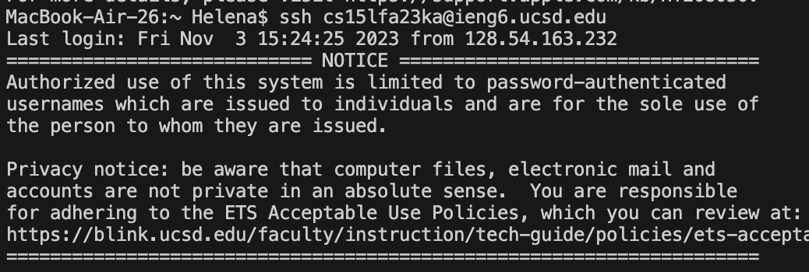
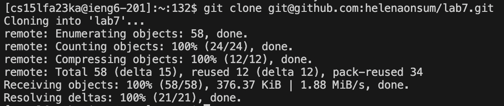
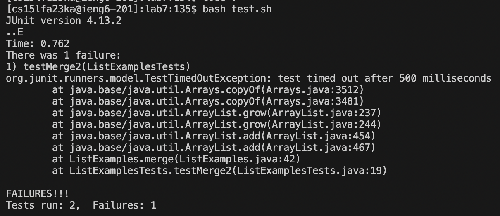
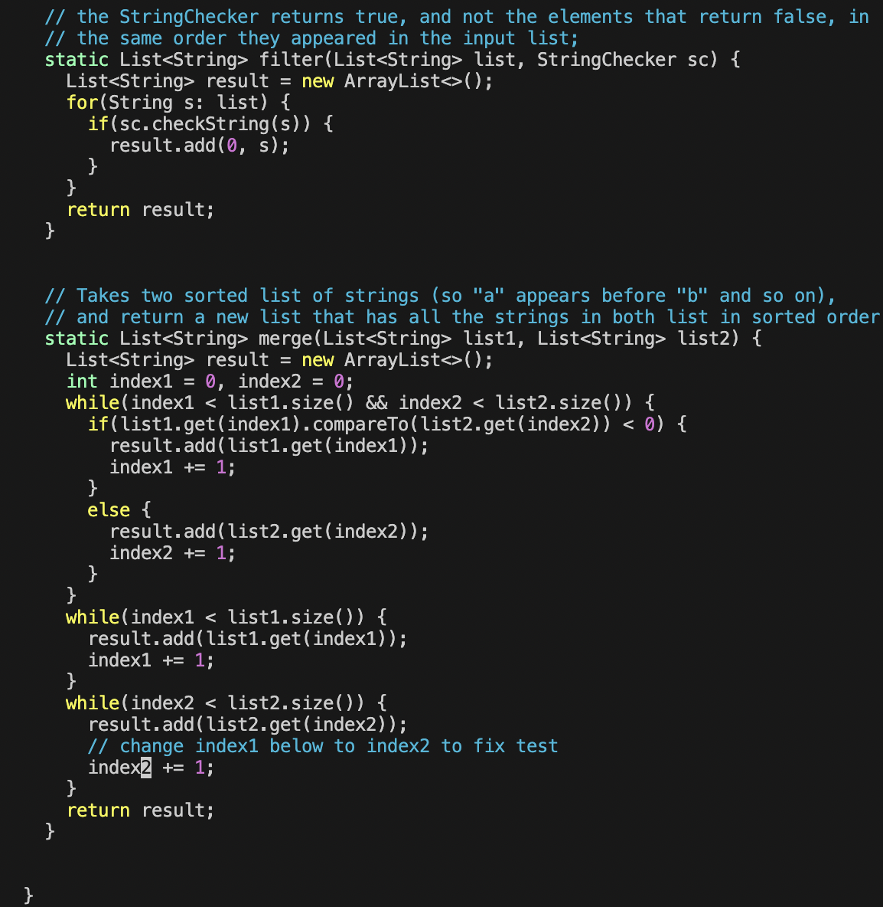
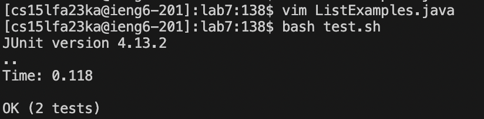
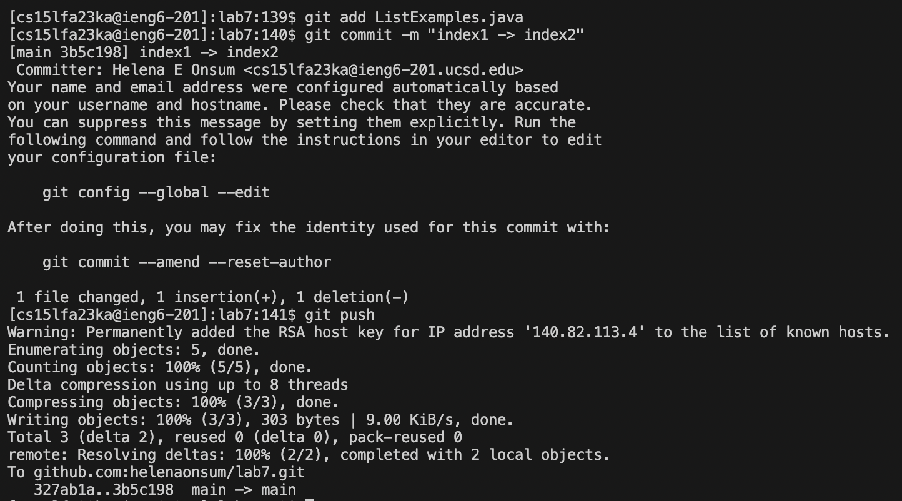

# Lab Report 4
## Helena Onsum, CSE 15 L
-----------------------------------------------
# *VIM* 

**Log into ieng6:**

*Typed the command* `sshcs15lfa23ka@ieng6.ucsd.edu` *and then clicked* `<enter>` *to log in to ieng6.*

**Clone your fork of the repository from your Github account (using the SSH URL):**

*Typed the command* `git clone git@github.com:helenaonsum/lab7.git` *and then clicked* `<enter>` *to clone my fork of the repository from my Github account using the SSH URL*

**Run the tests, demonstrating that they fail:**

*First I typed the command* `cd lab7` *and then clicked* `<enter>` *to change directory to be lab7*. *Then I typed the command* `bash test.sh` *and then clicked* `<enter>` *to run the tests. The output above shows that a test failed.*

**Edit the code file to fix the failing test:**

*First I typed* `vim ListExamples.java` *to open vim on the ListExamples.java file to edit the code. Then I typed* `:44` *to move to the 44th line of the code where the error could be found. I then typed* `e` *to move to the end of the word "index1". I then clicked the left arrow key* `->` *once to move to the character behind the 1 on "index1"* *After that, I typed* `i` *to enter insert mode. I then typed* `d` *to delete the character "1" from "index1". I then typed* `2` *which now made the word "index2" instead of "index1" which should fix the error. To exit out of insert mode, I clicked the escape button* `<esc>` *To save my edits and exit out of vim, I typed* `:wq` *and then clicked* `<enter>`

**Run the tests, demonstrating that they now succeed:**

*I typed the command* `bash test.sh` *and then clicked* `<enter>` *to run the tests. The output above shows that both tests passed.*

**Commit and push the resulting change to your Github account (you can pick any commit message!):**

*I typed the command* `git add ListExamples.java` *and then clicked* `<enter>` *to stage ListExamples.java to be part of the next commit. I then typed* `git commit -m "index1 -> intex2"` *to create a commit for the staged file ListExamples.java with the commit message "index1 -> intex2". Lastly, I typed* `git push` *to copy the new commit to my Github account.*

