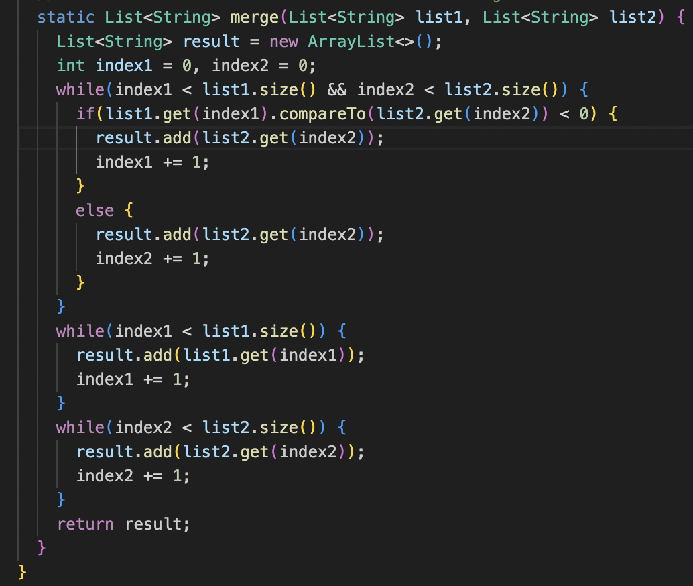
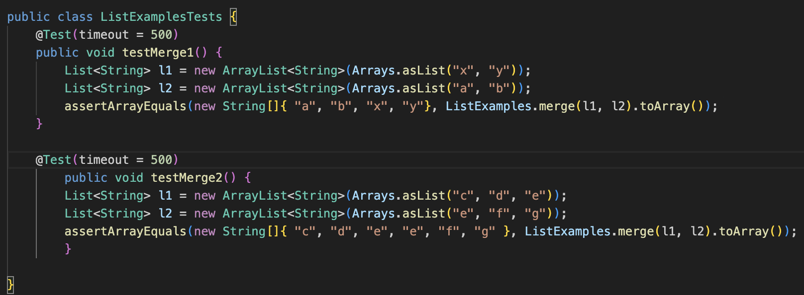
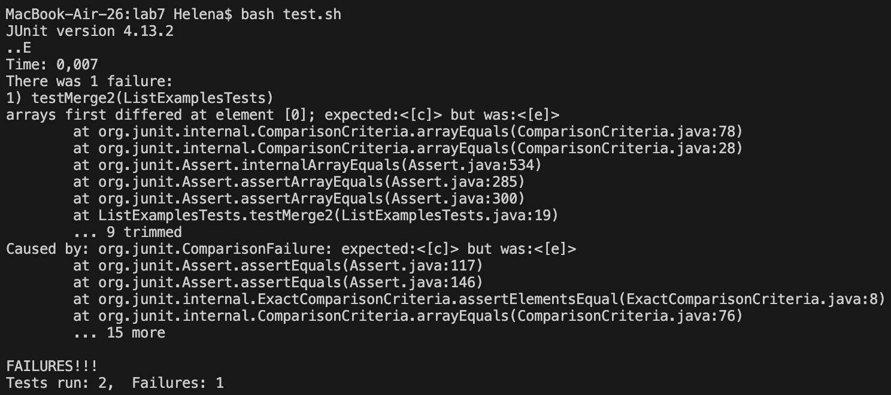
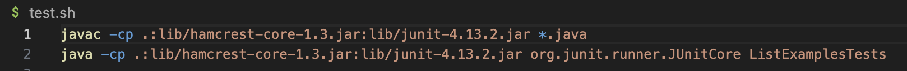
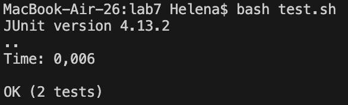

# Lab Report 5
## Helena Onsum, CSE 15 L
-----------------------------------------------
# *Putting it All Together* 

**PART 1 - Debugging Scenario:**

**1. The original post from a student with a screenshot showing a symptom and a description of a guess at the bug/some 
sense of what the failure-inducing input is.**
  ```
  Hi!
  When running my merge method on some tests, I get an error message in JUnit that indicates that my
  method does not return a merged list in sorted order. I suspect that the bug is related to the
  order in which content from each list is added to the new merged list and am therefore thinking
  there could be a logic error in comparing and adding values to the new list. I am thinking this
  because the JUnit output tells me that the first index of the second list is the first index of
  the new one, and if my method sorted and added values to the new list correctly, I would expect
  this index to be the first index of the first list instead. I also think this could be what
  the bug is since my first test passes, which has input where the merged list would be in sorted
  order if the second list was added first and then the first list was added, whereas my failing test,
  testMerge2,d has input requiring more sorting/comparisons of each value in each list.
  Any help or advice would be much appreciated.
  Below I have included some of my code and JUnit output for context.

  Thank you!
  ```

  `This is my merge method:`

  

  `These are the tests I ran (testMerge2 is the failing test):`

  

  `This is my JUnit output (the screenshot also shows the command line I ran to trigger the bug - i.e. bash test.sh):`

  

  `Here is my bash script that I used to compile and run my tests:`

  

**2. A response from a TA asking a leading question or suggesting a command to try**
   ```
   Hi!
   I think you are on the right track.
   The bug does seem to stem from a logic error in comparisons and adding to the new list when
   merging the values of the
   two old lists. I would suggest looking closely at the code inside the if statement of your
   merge method and specifically at what list and index you are adding values from when the
   if statement returns true. A hint is that your else statement appears correct, so maybe
   you could reverse engineer your logic from the else statement and see if it applies to
   the if statement.
   Hope that helps! Feel free to come back to this thread with more questions, or come to
   my office hours this week and we can discuss it!
   ```
**3. Another screenshot/terminal output showing what information the student got from trying that, and a clear description of what the bug is.**
   
   

   The bug in the code was that the indeces from the second list, not the first, were being added to the new merged list when the if statement    `if(list1.get(index1).compareTo(list2.get(index2)) < 0)` returned true.
   This was a logic error that did not make sense, since the if statement covered the sorting logic that if the index from list 1 is larger than list 2, the index of list 1 should be added to ensure correct sorting of values in the merged list. When the student modified the line
     `result.add(list2.get(index2));` to be `result.add(list1.get(index1));` the method merged correctly, and all tests passed (see above JUnit output).

**4. At the end, all the information needed about the setup including:**

    - The file & directory structure needed:
    
      ```
      Lab7
        - ListExamples.java (where the merge method is)
        - ListExamplesTests.java (where the tests for the merge method are)
        - test.sh (the bash script to run the merge tests)
      ```
        
    - The contents of each file before fixing the bug
      See the above screenshots in the student post for the merge method, the bash script and the merge tests.
      These three screenshots show the contents of each file before fixing the bug
    - The full command line (or lines) you ran to trigger the bug
      `bash test.sh`
    - A description of what to edit to fix the bug
      See the description of the image showing that all tests passed. 

**PART 2 - Reflection:**
The second half of this quarter I learned how to use Vim and Jdb. 
I liked learning about Vim the most, and learned a lot from my lab-partners who showed me different Vim shortcuts
and how to navigate Vim quickly. 
When learning about Jdb, my TA helped me find extra outside resources to learn from as I was struggling to understand 
some parts of the Jdb content, and through this experience I learned about new ways to find help/learn when struggling with a topic. 
I also enjoyed learning how to build an autograder which is something we continuously worked on in labs.  
